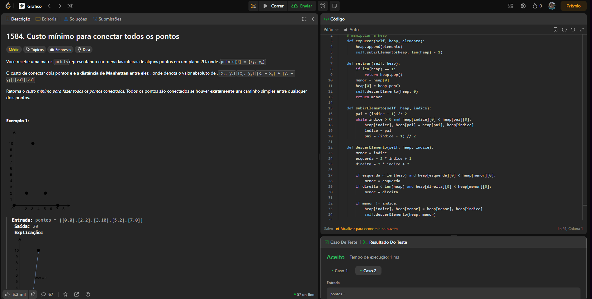
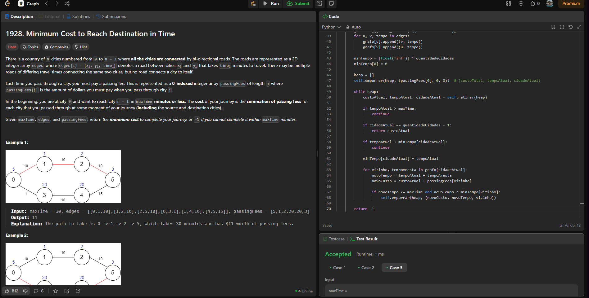

# Grafos2_DesafiosLeetCode

**Número da Lista**: Grafos 2 
**Conteúdo da Disciplina**: Grafos 2 

## Alunos

| Matrícula  | Aluno                          |
| ---------- | ------------------------------ |
| 22/1008051 | GABRIEL HENRIQUE CASTELO COSTA |
| 21/1030809 | JULIO CESAR ALMEIDA DOURADO    |

## Sobre

Nosso projeto foi resolução de problemas do LeetCode.

## Link de apresentação no Youtube
[Clique aqui](https://youtu.be/ilg64m6Xzlk) 

## Screenshots do Projeto em Funcionamento

Aqui estão algumas imagens do projeto em funcionamento:

#### Desafio 1 [1584. Min Cost to Connect All Points(MEDIUM)](https://leetcode.com/problems/min-cost-to-connect-all-points/description/?envType=problem-list-v2&envId=graph&difficulty=MEDIUM)

#### Desafio 2 [1928. Minimum Cost to Reach Destination in Times(HARD)](https://leetcode.com/problems/minimum-cost-to-reach-destination-in-time/description/?envType=problem-list-v2&envId=graph&difficulty=HARD)

#### Desafio 3 [2203. Minimum Weighted Subgraph With the Required Paths(HARD)](https://leetcode.com/problems/minimum-weighted-subgraph-with-the-required-paths/?envType=problem-list-v2&envId=graph&difficulty=HARD)

## Uso

Realizamos os testes em nossas proprias maquinas com
python versão 3.13.0

Para rodar o arquivo manualmente: 
`python nomeDoArquivo.py`
